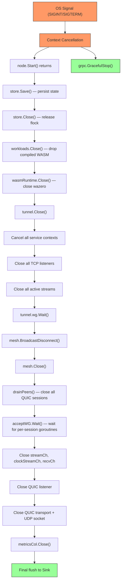
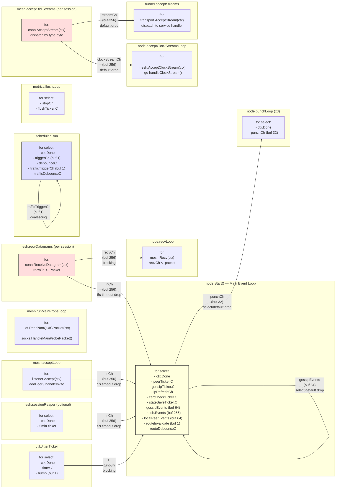

# Pollen Concurrency Model

## Per-Package Concurrency Summary

| Package | Produces Work | Consumes Work | Goroutines | Channels | Mutexes | Pattern |
|---------|--------------|---------------|------------|----------|---------|---------|
| types | -- | -- | 0 | 0 | 0 | Immutable value type |
| nat | -- | -- | 0 | 0 | RWMutex (Detector) | Synchronous with lock |
| perm | -- | -- | 0 | 0 | sync.Once (user lookup) | Synchronous |
| cas | -- | -- | 0 | 0 | 0 | Atomic file write (tmp+rename) |
| sysinfo | -- | -- | 0 | 0 | 0 | Stateless pure function |
| util | Ticks via `C` channel | Bump via `bump` channel | 1 per ticker | 2 (C, bump) | 0 | Channel-mediated timer loop |
| workspace | -- | -- | 0 | 0 | 0 | Stateless |
| logging | -- | -- | 0 | 0 | 0 | One-shot initializer (dead) |
| metrics | Snapshots to Sink.Flush | Counter.Inc/Gauge.Set from callers | 1 per Collector (flush loop) | 1 (stopCh) | Mutex (map registration) | Lock-free atomics + periodic flush |
| traces | Exports to Sink.Export | Span.End from callers | 0 | 0 | 0 | Single-owner spans, sync export |
| topology | -- | -- | 0 | 0 | 0 | Pure functions, stateless |
| traffic | Snapshots via RotateAndSnapshot | Record from stream goroutines | 0 | 0 | Mutex (ring buffer) | Passive aggregator under lock |
| peer | Outputs via Step() return | Inputs via Step() parameter | 0 | 0 | RWMutex (peer map) | Deterministic state machine |
| sock | Conn results to Punch callers | Probe packets via HandleMainProbePacket | up to 257 per Punch (ephemeral) | 1 per Punch (result ch) | Mutex (probeMu, connList) | Fan-out race, first-wins |
| auth | -- | -- | 0 | 0 | 0 | Stateless crypto functions + file I/O |
| config | -- | -- | 0 | 0 | 0 | Stateless file I/O |
| store | Callbacks (onDeny, onRouteInvalidate, onWorkloadChange, onTrafficChange) | Method calls from node goroutines | 0 | 0 | RWMutex (state) + Mutex (disk) | Passive CRDT under lock |
| mesh | Events to inCh, packets to recvCh, streams to streamCh/clockStreamCh | QUIC datagrams, streams, probe packets | 2 global + 2 per session + ephemeral | 5 core + per-session | RWMutex (sessions) + Mutex (probes) | Per-session goroutine pair, channel fan-in |
| route | Changed() notification channel | Update() from node | 0 | 1 (changeCh barrier) | RWMutex (routes) | Passive with barrier notification |
| tunnel | Stream open/accept, bridge goroutines | AcceptStream from mesh, TCP accept | 1 (accept loop) + 2 per bridge + 1 per TCP listener | 0 | 2 RWMutex + 1 Mutex | Per-connection goroutine pair |
| wasm | -- | Compile/Call from workload/scheduler | 0 | 1 (semaphore) | Mutex (cache) | Semaphore-gated execution |
| workload | -- | Seed/Call from scheduler/node | 0 | 0 | Mutex (workloads map) | Synchronous with lock |
| scheduler | Gossip events via publish callback | Signal/SignalTraffic from store callbacks | 1 (Run loop) + N (executeClaim) | 2 (triggerCh, trafficTriggerCh) | Mutex (inFlight) | Debounced reconciler with background claims |
| node | Gossip broadcasts, peer commands, punch requests | mesh.Events, localPeerEvents, gossipEvents, punchCh, routeInvalidate, tickers | 7+ persistent + ephemeral | 5 owned + reads mesh channels | 0 (single-goroutine main loop) | Central event loop with owned channels |
| server | gRPC responses | gRPC requests, context cancellation | 2 (serve + shutdown waiter) | 0 | 0 | conc/pool with cancel-on-error |
| cmd/pln | -- | OS signals | 2 in runNode (node + gRPC) | 0 | 0 | conc/pool, signal-driven shutdown |

## System-Wide Channel Map

| Channel | Owner | Type | Buffer | Producer(s) | Consumer(s) | Backpressure |
|---------|-------|------|--------|-------------|-------------|-------------|
| `mesh.recvCh` | mesh.impl | `chan Packet` | 256 | Per-session `recvDatagrams` goroutines | `node.recvLoop` via `mesh.Recv()` | Blocks sender until space or ctx.Done |
| `mesh.inCh` | mesh.impl | `chan peer.Input` | 256 | `addPeer`, `recvDatagrams`, `handleSendFailure`, `sessionReaper` | `node.Start` main loop via `mesh.Events()` | Drops with warning after 5s timeout |
| `mesh.streamCh` | mesh.impl | `chan incomingStream` | 256 | Per-session `acceptBidiStreams` (tunnel type) | `tunnel.Manager.acceptStreams` via `mesh.AcceptStream()` | Drops immediately (default branch, stream cancelled) |
| `mesh.clockStreamCh` | mesh.impl | `chan incomingStream` | 256 | Per-session `acceptBidiStreams` (clock type) | `node.acceptClockStreamsLoop` via `mesh.AcceptClockStream()` | Drops immediately (default branch, stream cancelled) |
| `mesh.renewalCh` | mesh.impl | `chan *CertRenewalResponse` | 1 | `acceptBidiStreams` (renewal response handler) | `mesh.RequestCertRenewal()` | Non-blocking send (default drops) |
| `mesh.sessions.changeCh` | sessionRegistry | `chan struct{}` | 0 | `sessionRegistry.add()` (close+replace) | `mesh.openTypedStream` wait loops via `sessions.onChange()` | Barrier pattern: closed on change, replaced with fresh chan |
| `node.localPeerEvents` | node.Node | `chan peer.Input` | 64 | `doConnect`, `punchLoop`, deny callback, `ConnectService` | `node.Start` main loop | Mostly blocking; deny callback drops via select/default |
| `node.gossipEvents` | node.Node | `chan []*GossipEvent` | 64 | `queueGossipEvents` (from store mutations, scheduler publish) | `node.Start` main loop | Drops via select/default on full |
| `node.punchCh` | node.Node | `chan punchRequest` | 32 | `handlePunchCoordTrigger` | 3x `punchLoop` goroutines | Drops via select/default on full |
| `node.routeInvalidate` | node.Node | `chan struct{}` | 1 | `signalRouteInvalidate` (from store.OnRouteInvalidate callback) | `node.Start` main loop | Coalescing: at most 1 pending signal |
| `node.ready` | node.Node | `chan struct{}` | 0 | `node.Start` (closed once) | `node.Ready()` callers | Barrier: closed once, never sent on |
| `route.changeCh` | route.Table | `chan struct{}` | 0 | `route.Table.Update()` (close+replace) | `mesh.routeChanged()` via `route.Table.Changed()` | Barrier pattern |
| `util.JitterTicker.C` | JitterTicker | `chan time.Time` | 0 | JitterTicker background goroutine | `node.Start` main loop (gossip tick) | Blocks ticker goroutine until consumed |
| `util.JitterTicker.bump` | JitterTicker | `chan struct{}` | 1 | `JitterTicker.Bump()` (never called) | JitterTicker goroutine | Non-blocking (unused) |
| `metrics.Collector.stopCh` | Collector | `chan struct{}` | 0 | `Collector.Close()` (closed) | `flushLoop` goroutine | Barrier: closed once |
| `scheduler.triggerCh` | Reconciler | `chan struct{}` | 1 | `Signal()` from store callbacks, post-claim defer, node connect/disconnect | `Reconciler.Run()` loop | Coalescing: non-blocking select/default |
| `scheduler.trafficTriggerCh` | Reconciler | `chan struct{}` | 1 | `SignalTraffic()` from store.OnTrafficChange callback | `Reconciler.Run()` loop | Coalescing: non-blocking select/default |
| `wasm.Runtime.sem` | Runtime | `chan struct{}` | maxConcurrency (GOMAXPROCS) | `Call()` release via defer | `Call()` acquire via select | Blocks caller until slot available or ctx.Done |
| `sock.mainProbes[nonce]` | sockStore | `chan *net.UDPAddr` | 1 | `HandleMainProbePacket` (probe response) | `scatterProbeMain` (waiting for response) | Per-probe ephemeral channel |
| Punch result channel | sockStore.Punch | `chan *Conn` | 1 | Ephemeral probe goroutines (first success) | `Punch()` caller | First writer wins; losers hit default (close their socket) |

## Goroutine Lifecycle Table

### Persistent Goroutines

| Name | Package | Spawned By | Lifetime | Shutdown Mechanism |
|------|---------|-----------|----------|-------------------|
| Main event loop | node | `node.Start()` | Process lifetime | `<-ctx.Done()` returns nil |
| `recvLoop` | node | `node.Start()` | Process lifetime | `ctx.Done()` terminates `mesh.Recv()` |
| `acceptClockStreamsLoop` | node | `node.Start()` | Process lifetime | `ctx.Done()` or accept error |
| `punchLoop` (x3) | node | `node.Start()` | Process lifetime | `<-ctx.Done()` in select |
| `scheduler.Run` | scheduler | `node.Start()` (as goroutine) | Process lifetime | `<-ctx.Done()` in select |
| `acceptLoop` | mesh | `mesh.Start()` | Process lifetime | Listener close causes Accept() error |
| `runMainProbeLoop` | mesh | `mesh.Start()` | Process lifetime | Transport close causes ReadNonQUICPacket error |
| `sessionReaper` | mesh | `mesh.Start()` (if maxConnectionAge > 0) | Process lifetime | `<-ctx.Done()` in select |
| `flushLoop` | metrics | `metrics.New()` | Collector lifetime | `<-stopCh` closed by `Collector.Close()` |
| JitterTicker goroutine | util | `NewJitterTicker()` | Ticker lifetime | `<-ctx.Done()` in select |
| `acceptStreams` | tunnel | `tunnel.Start()` | Manager lifetime | `ctx.Done()` via transport.AcceptStream error |

### Per-Session Goroutines (mesh)

| Name | Package | Spawned By | Lifetime | Shutdown Mechanism |
|------|---------|-----------|----------|-------------------|
| `recvDatagrams` | mesh | `addPeer()` | Session lifetime | QUIC conn context done -> ReceiveDatagram error |
| `acceptBidiStreams` | mesh | `addPeer()` | Session lifetime | QUIC conn context done -> AcceptStream error |

Both tracked via `mesh.acceptWG` (sync.WaitGroup). Cleaned up during `mesh.Close()` after `drainPeers()`.

### Per-Connection Goroutines (tunnel)

| Name | Package | Spawned By | Lifetime | Shutdown Mechanism |
|------|---------|-----------|----------|-------------------|
| TCP accept loop | tunnel | `ConnectService()` | Connection lifetime | `ln.Close()` from disconnect |
| Stream open + bridge | tunnel | TCP accept loop | Per-TCP-connection | Bridge completion or stream error |
| Bridge read goroutine (x2) | tunnel | `bridge()` | Per-stream | io.Copy completion, sync.Once teardown |

All tracked via `tunnel.Manager.wg` (sync.WaitGroup). Cleaned up during `tunnel.Close()`.

### Ephemeral Goroutines

| Spawn Point | Package | Lifecycle | Guarantees |
|-------------|---------|-----------|------------|
| `doConnect` | node | One-shot per peer connect attempt | Sends result to `localPeerEvents` (blocking) or exits on mesh error |
| `requestPunchCoordination` | node | One-shot per punch coord request | Sends gossip event, fire-and-forget |
| `handlePunchCoordRequest` (x2) | node | One-shot per coord relay | Sends trigger to both peers concurrently |
| `handleClockStream` | node | One-shot per accepted clock stream | Processes digest, responds, closes stream |
| Per-peer clock gossip | node | One-shot per peer per gossip tick | Tracked via `sync.WaitGroup` in `gossip()` |
| Per-peer eager sync | node | One-shot on PeerConnected | 5s timeout context, fire-and-forget |
| `executeClaim` | scheduler | One-shot per workload claim | Fetch + seed + publish; re-signals on completion |
| `fetchFrom` timeout closer | scheduler | One-shot per fetch attempt | Closes stream on ctx timeout; exits on `done` channel |
| `InvokeOverStream` timeout closer | scheduler | One-shot per invocation | Closes stream on ctx cancel |
| Punch ephemeral probers (x256) | sock | Per-Punch call | Each opens ephemeral UDP socket; ctx cancel + 1s read timeout |
| `scatterProbeMain` | sock | Per-Punch call (1 goroutine) | Registers nonce, sends probes, waits for response or ctx cancel |
| `raceDirectDial` goroutines | mesh | Per-Connect call (1 per address) | First success cancels rest; cleanup goroutine drains losers |
| `handleInviteConnection` | mesh | Per inbound invite ALPN | Spawned from acceptLoop |
| `handleRoutedStream` | mesh | Per inbound routed stream | Forwarding or local delivery |
| Artifact/workload handler dispatch | mesh | Per accepted artifact/workload stream | `go handler(stream, peerKey)` |

## Shutdown Ordering

Note: The shutdown sequence is implemented in `node.Start()` via `defer n.shutdown()`. The gRPC server shuts down independently via `conc/pool` context cancellation in `cmd/pln.runNode`. The deferred shutdown in `node.Start` executes in reverse registration order (Go defer semantics), producing the ordering shown above.

## Thread-Boundary Diagram

### Thread Boundary Legend

- **Yellow**: The main event loop in `node.Start()` -- single-goroutine owner of all mutable node state (maps, scalars, coordinate, streak counters). No mutex needed; all mutation happens here.
- **Blue**: The scheduler reconciler loop -- owns `pendingRelease` and `firstRun`. Communicates with the main loop indirectly via store callbacks and gossip publish.
- **Red**: Per-session mesh goroutines -- one pair (`recvDatagrams` + `acceptBidiStreams`) per connected peer. Feed channels consumed by the main loop and tunnel/clock accept loops.
- All channel buffer sizes and backpressure behaviors are annotated on edges.
- "Coalescing" means extra signals are silently dropped via `select/default` on a buffered-1 channel -- at most one pending signal is retained.
- "Default drop" means the stream/packet is discarded immediately if the channel is full -- the sender does not block.
- "Blocking" means the sender blocks until the receiver reads -- natural backpressure.
