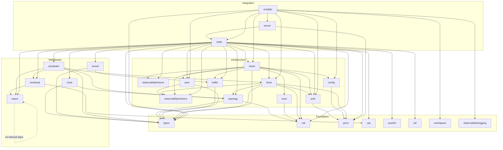
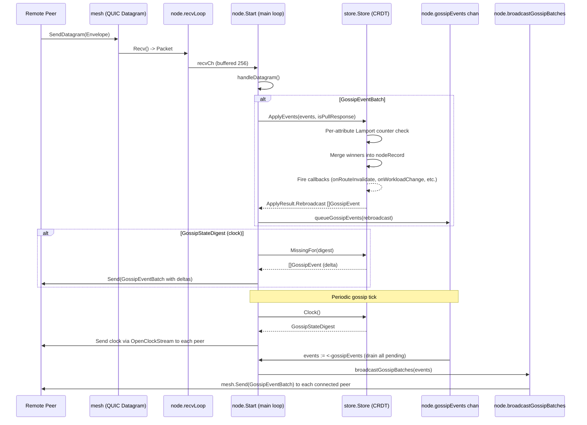
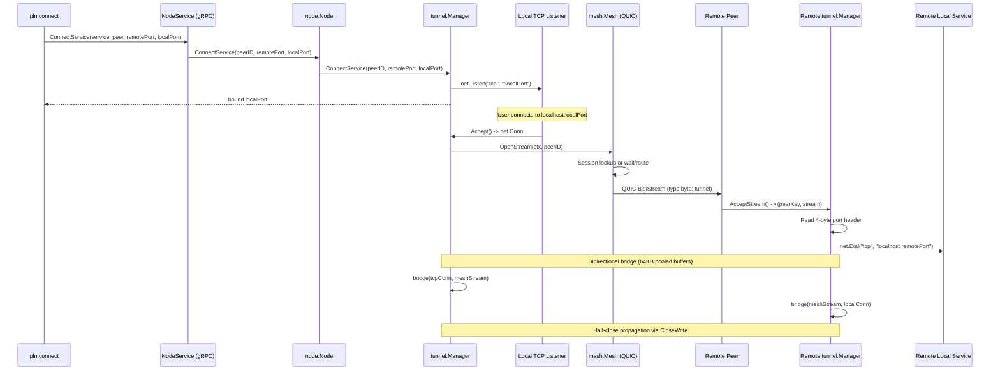
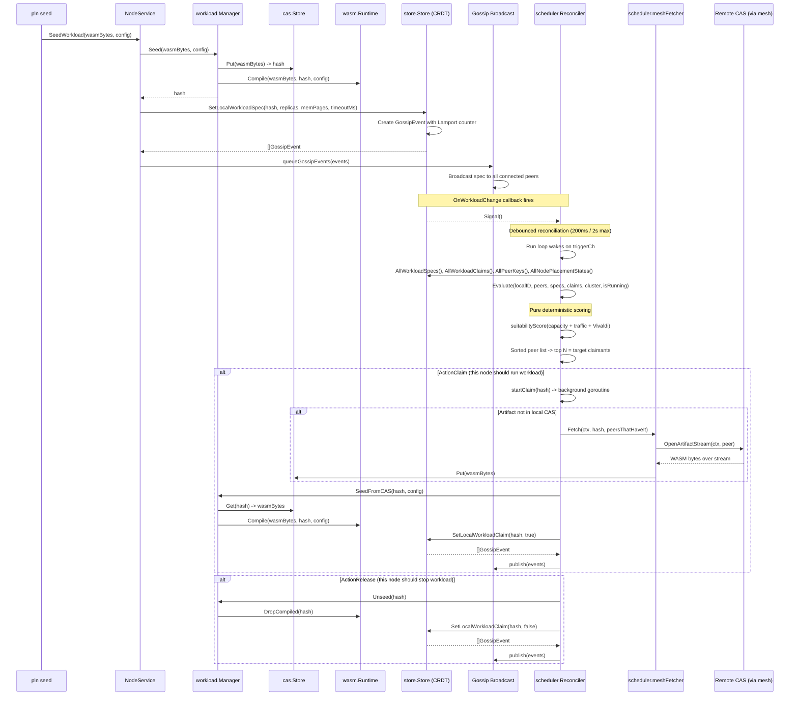

# Pollen System Overview

## What is Pollen?

Pollen is a decentralized mesh-networking platform that connects nodes into a peer-to-peer overlay network with automatic NAT traversal, cryptographic cluster membership, and distributed workload execution. Nodes discover each other through gossip-based state synchronization, establish direct QUIC connections (with UDP hole-punching for NAT'd hosts), and maintain a Vivaldi coordinate system for latency-aware topology management. The system supports TCP service tunneling over the mesh, content-addressed WASM workload distribution, and a distributed scheduler that places workloads across the cluster based on capacity, traffic affinity, and network proximity.

The architecture follows a layered composition model. Foundation packages (`types`, `nat`, `perm`, `cas`, `topology`, `traffic`) provide pure value types, algorithms, and utilities with zero or minimal internal dependencies. Infrastructure packages (`store`, `mesh`, `peer`, `sock`, `auth`) implement the core subsystems: CRDT gossip state, QUIC transport, peer lifecycle state machines, NAT hole-punching, and cryptographic trust chains. Middleware packages (`scheduler`, `tunnel`, `route`, `workload`, `wasm`) compose infrastructure into business-logic features: distributed placement, TCP forwarding, multi-hop routing, and WASM execution. Integration packages (`node`, `server`, `cmd/pln`) wire everything together: `node` is the central orchestrator with the main event loop, `server` exposes a gRPC control plane, and `cmd/pln` provides the CLI entry point.

Data flows through three primary paths. Gossip state (network info, services, Vivaldi coordinates, workload specs/claims, traffic heatmaps) propagates via CRDT delta-sync over QUIC datagrams, with per-attribute Lamport counters and tombstones for conflict resolution. Tunnel traffic flows from local TCP listeners through mesh QUIC streams to remote service endpoints, with bidirectional byte-counting for traffic-aware scheduling. Workload artifacts flow from the seeding node through content-addressed storage, are fetched over mesh artifact streams by claiming nodes, compiled via the Extism/wazero WASM runtime, and invoked either locally or remotely through mesh workload streams.

## Package Dependency Graph

## Data Flow Diagrams

### Gossip Flow: Network Receipt -> Store -> Rebroadcast

### Tunnel Flow: CLI Connect -> Node -> Mesh -> Remote Peer

### Workload Flow: Spec Seed -> Gossip -> Scheduler -> Claim -> Fetch -> Execute

## Package Tier Table

| Tier | Package | Production LOC | Test LOC | Role |
|------|---------|---------------|----------|------|
| **Foundation** | types | 53 | 0 | Core `PeerKey` identity type (32-byte ed25519 public key) |
| **Foundation** | nat | 110 | 129 | NAT type classification (Easy/Hard) from observed addresses |
| **Foundation** | perm | 195 | 196 | File/directory permissions with Linux pln-group enforcement |
| **Foundation** | cas | 88 | 67 | Content-addressable filesystem store for WASM artifacts |
| **Foundation** | sysinfo | 23 | 0 | System resource sampling (CPU, memory) via gopsutil |
| **Foundation** | util | 66 | 0 | Jittered ticker for gossip interval randomization |
| **Foundation** | workspace | 26 | 0 | Data directory creation with permission error hints |
| **Foundation** | observability/logging | 23 | 0 | Global zap logger initialization (dead code) |
| **Infrastructure** | observability/metrics | 462 | 242 | Atomic counters, gauges, EWMA, pluggable sink flush loop |
| **Infrastructure** | observability/traces | 212 | 106 | Minimal distributed tracing with TraceID/SpanID propagation |
| **Infrastructure** | topology | 560 | 818 | Vivaldi coordinates and topology-aware peer selection (3-layer budget) |
| **Infrastructure** | traffic | 203 | 158 | Per-peer byte-counting with sliding-window ring buffer |
| **Infrastructure** | peer | 561 | 611 | Deterministic peer connection lifecycle state machine |
| **Infrastructure** | sock | 339 | 182 | UDP NAT hole-punching with nonce-based probe protocol |
| **Infrastructure** | auth | 1107 | 700 | Ed25519 delegation certs, join/invite tokens, credential persistence |
| **Infrastructure** | config | 399 | 150 | YAML config persistence for bootstrap peers, services, connections |
| **Infrastructure** | store | 2537 | 2892 | CRDT gossip state store with per-attribute Lamport counters |
| **Infrastructure** | mesh | 2122 | 1008 | QUIC peer connections, datagram/stream transport, TLS identity |
| **Middleware** | route | 190 | 194 | Dijkstra shortest-path routing over Vivaldi-weighted graph |
| **Middleware** | tunnel | 463 | 0 | TCP-over-mesh service tunneling with bidirectional bridging |
| **Middleware** | wasm | 310 | 192 | Extism/wazero WASM compilation cache and execution engine |
| **Middleware** | workload | 229 | 117 | Workload lifecycle orchestration (seed/call/unseed) |
| **Middleware** | scheduler | 1116 | 1206 | Distributed placement scoring, debounced reconciler, artifact fetch |
| **Integration** | node | 2513 | 1398 | Central orchestrator: main event loop, all subsystem coordination |
| **Integration** | server | 69 | 0 | gRPC Unix-socket transport for control plane |
| **Integration** | cmd/pln | 3126 | 361 | CLI entry point: all `pln` subcommands and daemon lifecycle |

### Tier Summary

| Tier | Packages | Total Prod LOC | Total Test LOC |
|------|----------|---------------|----------------|
| Foundation | 8 | 584 | 392 |
| Infrastructure | 10 | 8,502 | 6,867 |
| Middleware | 5 | 2,308 | 1,709 |
| Integration | 3 | 5,708 | 1,759 |
| **Total** | **26** | **17,102** | **10,727** |
